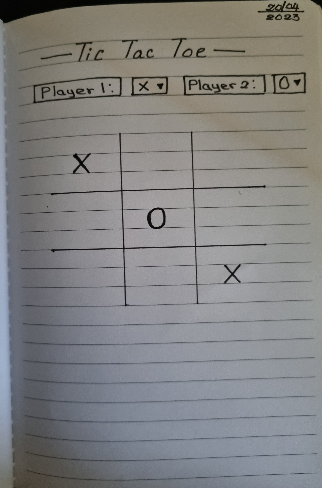
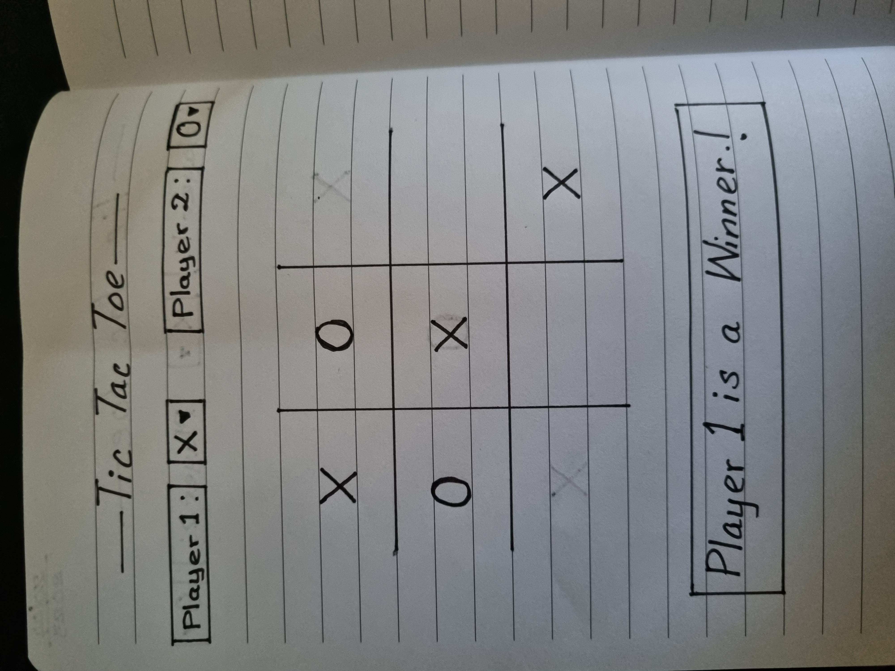
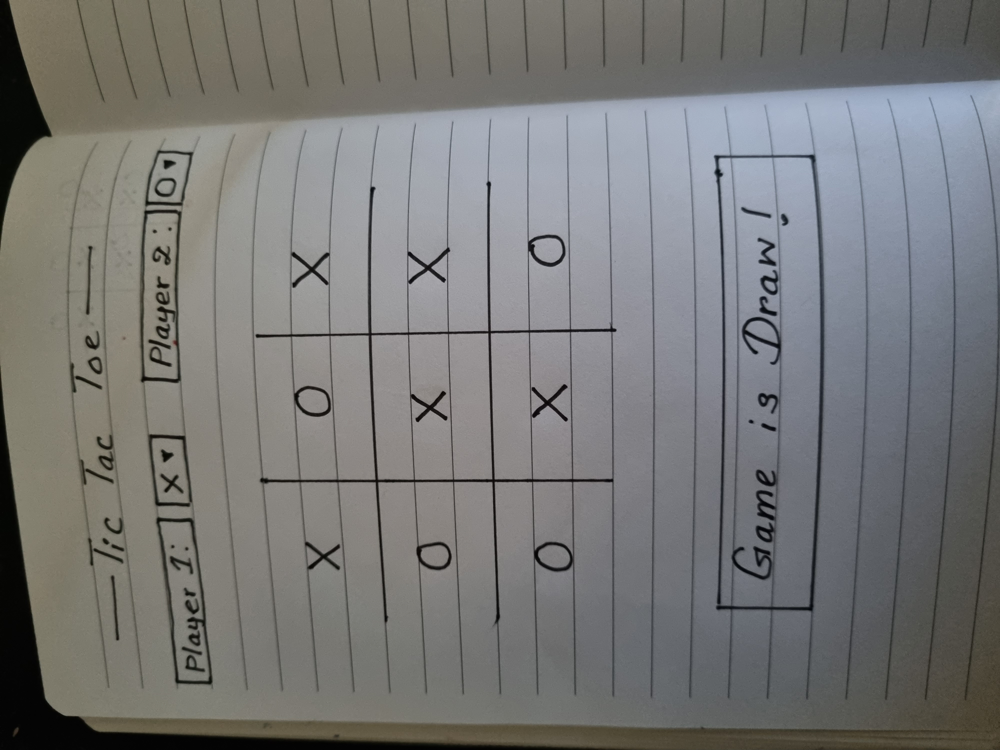

# tic-tac-toe
My first solo project for the General Assembly SEI course is Tic Tac Toe. It is a simple and fun game for 2 players, X and O play against each other using a 3×3 board. 

## 💻 [Click here](https://vishakasg.github.io/tic-tac-toe/) to see my live project!
## 📄 About
- This is a basic version of the popular game Tic Tac Toe. 
- X and O are the first and second players in the two-player game.
- On a 3x3 grid, players take turns selecting their moves in turn. 
- The winner is the first person to successfully occupy three adjacent slots in a row, column, or diagonal. 
- If neither player has won and all available spots on the board have been taken, the game is a draw.
- In-app screenshots.

## ✏️ Planning and Problem Solving
- Since this project is my first project, it was essential for me to invest my time to organising the structure of the game, defining its components and how they interact, and taking small incremental steps rather than focusing  the final outcome straight away.
- I used my knowledge of HTML, CSS, and Javascript to create a functional game.
- I created the HTML file and applied some fundamental CSS styling after sketching  a wireframe diagram and going over my user stories. Then I worked through the game logic by making a flow chart to find a solution to the issue of identifying user clicks on the board and switching the board component in accordance with the game's specifications.
- After I began manipulating the DOM using javascript, I felt somewhat more confident about the work I'm doing.
- In order to become proficient in  javaScript features and syntax, best practises for programming, and to debug mistakes and defects in the codes, I frequently referred to the multiple  sources of information throughout the development process. These sources comprise GA code_alongs, external blogs and online resources, as well as communicating with IAs about concerns.
- Screenshots during the planning phase.

- Flow charts of app logic.

## 🚀 Cool tech
- HTML
- CSS
- JavaScript
- DOM API
- Git and GitHub

## 😱 Bug to Fix 💩
- Remove the 'click' eventListener to prevent players from clicking on the same box more than once.
- To display a message when a game draws, codes must be placed correctly.
- The grid disappears as I move the pointer inside of it, and I have to reload the page to see it again.
- Allow players to customized their token(X or O).

## 😭 Lessons learnt
Since this project is my first significant entry into software engineering, my major objective was to complete the task within the allotted time while also increasing my level of proficiency with coding. The use of DOM manipulation was the biggest challenge, but it was a great chance for me to put what I had learnt into practise and advance my capacity to figure out the logic and build the game using  JavaScript, HTML and CSS.

## ✅ Future features
- Keep track of multiple game rounds with a win counter.
- Allow players to add their name and profile pictures
- Use less repetitive codes.
- Add a restart button to begin a new game round.
- Add a scoreboard.